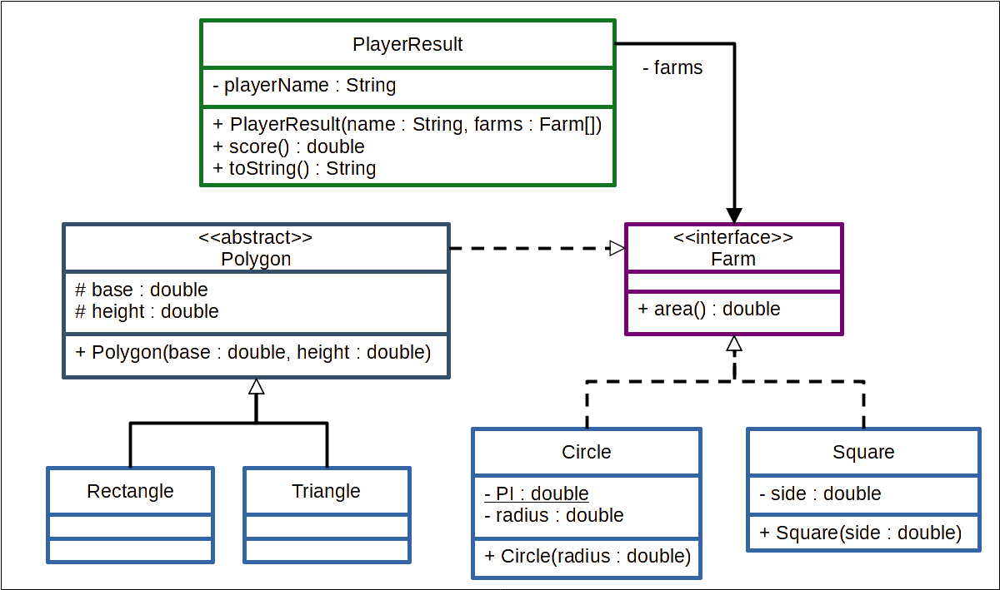

# Java Polimorfismo e interfaces

## Projeto de um jogo feita em java.

---

## Não se esqueça de consultar as documentações!

⚠️ **Importante**:

Esse projeto tem como intuito te treinar para ter mais familiaridade com a documentação de aplicações, por tanto, poderão haver alguns comandos ou atributos que não estão no curso, mas que devem ser descritos no decorrer dos requisitos.

Nesses casos, é importante se atentar a aquilo que o requisito pede, e lembrar sempre de utilizar a [documentação oficial](https://docs.oracle.com/en/java/javase/11/) do Java para pesquisar detalhes sobre comandos.

## Antes de começar a desenvolver

Lembre-se que você pode consultar nosso conteúdo sobre [Git & GitHub](https://course.betrybe.com/intro/git/) sempre que precisar!

1. Clone o repositório
  * Por exemplo: `git clone `
  * Entre no diretório do repositório que você acabou de clonar:
    * neste caso `cd jogo-das-fazendas`

2. Instale as dependências:
    * `mvn install`

 ⚠️ **Lembre-se do CheckStyle! Deixe seu Eclipse configurado para arrumar o estilo automaticamente. Qualquer dúvida, volte no conteúdo.**

---

---

# Requisitos do desafio

### Descrição do desafio: Área das fazendas

Imagine um jogo onde as pessoas jogadoras são fazendeiras e a pessoa vencedora é aquela que possui a maior quantidade de terras. Para desenvolver este jogo, precisamos calcular a área das fazendas de cada pessoa jogadora. Considere quatro formas possíveis das fazendas: triângulo, quadrado, retângulo e círculo.

Crie um programa usando a linguagem Java que calcule a área de diferentes fazendas. As fazendas na forma quadrada possuem o atributo lado, as circulares possuem o atributo raio e as fazendas triangulares e as retangulares possuem os atributos base e altura. Ao escrever as classes do seu programa, tome como base o diagrama UML a seguir:

Vamos colocar em prática as habilidades aprendidas nesta lição?

> **Dica**: apesar de a forma de um quadrado ser mais parecida com a de um retângulo, a melhor maneira de escrever o programa é considerar que o triângulo e o retângulo têm mais características em comum.
---
### Autor
---

<a href="https://github.com/hannibal1207">
 
  
 <b>Mathaus Annibal</b></a><a name="autor">🚀</a>

Feito com ❤️ por Mathaus Annibal 👋🏽 Entre em contato!

 

